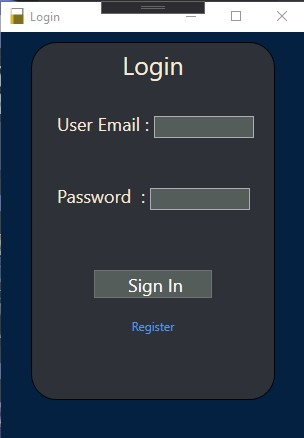
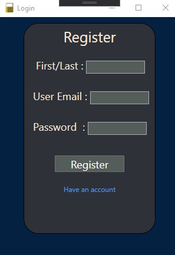
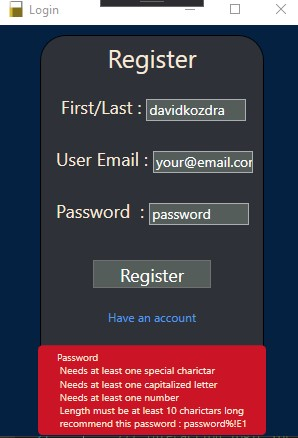
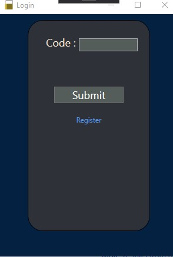
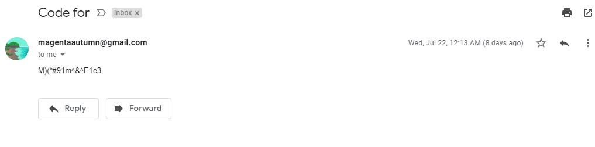
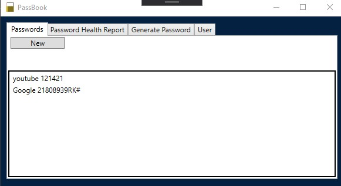
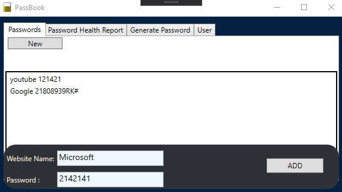
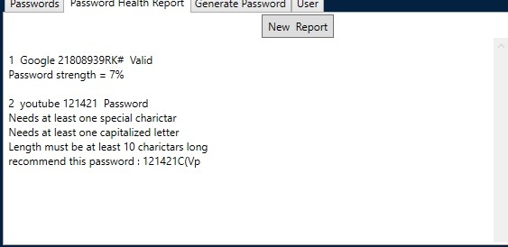
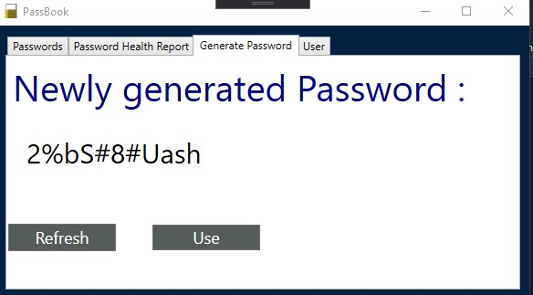

 ⚠️ NOTE :This project is currently not hosted and so it will not be testable ⚠️

# PassVault
  Passvault is a simple password holder for people who don't trust Google or last pass; this system verifies passwords and generates new passwords. WPF C# Desktop application that connects to a Postgres Database. 

##  Features

* login/registration
* Email verification
* random password generation
* stores and loads saved passwords
* allows for users to edit and delete passwords

###  Product Presentation

 
 The login page verifies items are in the SQL server
 Allows for page transfer to register

 Page transfers to log in if requested
 
 When a register is accepted a code verification page will be shown

 
 If the registration info is incorrect, this message will appear

Once registration is accurate the page asks for a code that was emailed to the address used to register

 
 Email code uses generation system to create unique codes

This is the main page of the app

 
 Adding a new item the source of the website and password

Passwords are tested for strength

 
 Creation of random password refresh gains new password
